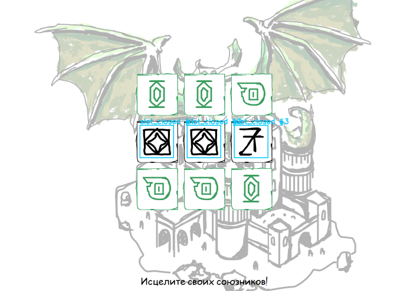
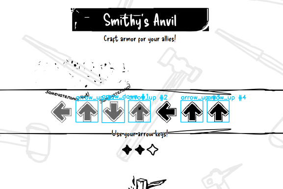

# Discord Last Meadow Online Bot

[English](#english) | [Русский](#русский)

---

## Русский

Визуальный бот-автоматизатор для Discord Activity **Last Meadow Online**. Использует распознавание изображений (OpenCV) для обнаружения элементов интерфейса и взаимодействует через Win32 API — без захвата мыши/клавиатуры, работает в фоне.

### Скриншоты

| Бой (мемори) | Изготовление (стрелки) |
|---|---|
|  |  |

### Что умеет

- **Приключения** — автоматический спам кнопки с нарастающей скоростью кликов
- **Изготовление** — распознаёт стрелки на экране, отправляет соответствующие клавиши, нажимает "Продолжить"
- **Бой (мемори)** — открывает карточки, запоминает содержимое, сравнивает между собой и находит тройки одинаковых
- **Таймеры** — определяет часики рядом с кнопками и пропускает действия пока таймер активен
- **Автовход** — заходит в игру, обрабатывает модалки и кнопки "Назад"

### Как работает

1. Захватывает окно Discord через `PrintWindow` (работает даже если окно перекрыто)
2. Сравнивает скриншот с шаблонами изображений (template matching, multi-scale)
3. Отправляет клики через `PostMessage` и клавиши через Win32 API
4. Сценарии описаны в JSON-конфигах — редактируются без перезапуска (hot reload)

### Установка

**Требования:**
- Windows 10/11
- Python 3.10+
- Discord (десктоп-приложение)

```bash
git clone https://github.com/beekamai/discord-lmo-bot.git
cd discord-lmo-bot
pip install -r requirements.txt
```

### Запуск

```bash
# Обычный режим (без окна визуализации)
python main.py

# С окном визуализации (видно что бот распознаёт)
python main.py --vision

```

Нажми `Esc` в окне визуализации для остановки, или `Ctrl+C` в консоли.

### Создание шаблонов

```bash
python scripts/capture_template.py
```

Скрипт делает скриншот окна Discord и сохраняет в `templates/full_screen.png`. Открой в Paint/Photoshop, вырежи нужные кнопки/элементы и сохрани как отдельные `.png` файлы в папку `templates/`.

### Настройка сценариев

Все сценарии — JSON-файлы в `configs/scenarios/`. Бот загружает их автоматически при запуске и поддерживает **hot reload** (изменил файл → бот подхватил без перезапуска).

#### Приоритеты

Каждый сценарий имеет `priority`. Чем меньше число — тем раньше проверяется. На каждом кадре бот проходит сценарии по порядку приоритета: первый кто нашёл свой триггер — выполняется.

#### Режимы сценариев

**`whitelist`** — кликает любую разрешённую кнопку, пока не найдёт точку выхода.
```json
{
    "mode": "whitelist",
    "priority": 2,
    "trigger_templates": ["templates/trigger.png"],
    "exit_templates": ["templates/done.png"],
    "allowed_clicks": [
        {"step_name": "Кнопка", "template": "templates/button.png", "confidence": 0.8}
    ],
    "post_delay_sec": 1.5
}
```

**`sequential`** — строгая последовательность шагов: шаг 1 → шаг 2 → ... → конец.
```json
{
    "mode": "sequential",
    "steps": [
        {"step_name": "Шаг 1", "templates": ["templates/btn1.png"], "post_delay_sec": 1.0, "repeats": 3},
        {"step_name": "Шаг 2", "templates": ["templates/btn2.png"]}
    ]
}
```

**`sequence_click`** — находит ВСЕ вхождения шаблона на экране, кликает слева направо.
```json
{
    "mode": "sequence_click",
    "trigger_templates": ["templates/arrow.png"],
    "allowed_clicks": [{"template": "templates/arrow.png", "click_delay": 0.3}]
}
```

**`spam_click`** — находит кнопку и спамит по ней N раз.
```json
{
    "mode": "spam_click",
    "trigger_templates": ["templates/button.png"],
    "spam_clicks": 2000,
    "spam_delay_ms": 50,
    "spam_recheck_every": 200
}
```

**`pipeline`** — цепочка разных действий. Самый мощный режим.
```json
{
    "mode": "pipeline",
    "loop": false,
    "trigger_templates": ["templates/craft.png"],
    "phases": [
        {"name": "Клик", "action": "click_once", "templates": ["templates/craft.png"]},
        {"name": "Стрелки", "action": "send_keys", "key_map": [
            {"template": "templates/left.png", "key": "left"},
            {"template": "templates/right.png", "key": "right"}
        ], "exit_templates": ["templates/done.png"]},
        {"name": "Продолжить", "action": "click_once", "templates": ["templates/continue.png"]}
    ]
}
```

#### Типы фаз в pipeline

| Фаза | Описание |
|---|---|
| `click_once` | Найти шаблон и кликнуть один раз. `skip_if_near` — пропустить если блокирующий шаблон (часики) правее |
| `spam_click` | Спам кликами. `duration_sec` или `click_count`, `delay_ms`, `ramp_up` для нарастающей скорости |
| `send_keys` | Найти шаблоны стрелок, отправить клавиши. `key_map` маппит шаблоны на клавиши |
| `sequence_click` | Найти все вхождения, кликнуть слева направо |
| `wait_for` | Ждать появления шаблона |
| `wait_disappear` | Ждать исчезновения шаблона (таймер). `near_template` — следить только рядом с кнопкой |
| `memory_match` | Игра мемори: открывает карточки, сравнивает между собой, находит тройки |

#### Ключевые параметры

| Параметр | Где | Описание |
|---|---|---|
| `priority` | все | Меньше = проверяется раньше |
| `confidence` | все | Порог совпадения шаблона 0.0-1.0 (по умолчанию 0.8) |
| `run_once` | сценарий | Выполнить только один раз |
| `skip_if_near` | pipeline click_once | Пропустить если блокирующий шаблон правее кнопки |
| `ramp_up` | pipeline spam_click | Массив коэффициентов нарастания `[0.3, 0.6, 1.0]` |
| `ramp_period_sec` | pipeline spam_click | Период цикла нарастания в секундах |
| `similarity` | pipeline memory_match | Порог схожести клеток 0.0-1.0 |
| `loop` | pipeline | Зациклить pipeline. `loop_exit_templates` для условия выхода |

### Архитектура

```
Capture Thread          Worker Thread           Main Thread
     |                       |                       |
  PrintWindow()         читает из буфера        читает из буфера
     |                       |                       |
  -> буфер кадров       template matching        рисует оверлеи
  (макс FPS)                 |                       |
                        выполнение сценариев     cv2.imshow()
                             |                   (если --vision)
                        клики / клавиши
                        (PostMessage)
```

Три потока: окно визуализации никогда не зависает, даже когда бот спамит кликами.

### Структура проекта

```
bot/
  engine.py           - FSM движок (capture + worker + display)
  vision.py           - template matching (multi-scale, find_all, cell comparison)
  window_capture.py   - захват окна Discord + клики/клавиши через Win32 API
  states/
    base.py           - базовый класс стейта
    scenario_state.py - whitelist, sequential, sequence_click, spam_click
    pipeline_state.py - pipeline с фазами
    loading_state.py  - автозакрытие попапов
configs/
  scenarios/          - JSON-конфиги сценариев
templates/            - PNG-шаблоны для распознавания
scripts/
  capture_template.py - утилита захвата скриншотов
```

---

## English

Visual automation bot for Discord Activity **Last Meadow Online**. Uses image recognition (OpenCV) to detect UI elements and interacts via Win32 API — no mouse/keyboard hijacking, runs in background.

### Features

- **Adventures** — auto-clicks the adventure button with ramping click speed
- **Crafting** — recognizes arrow patterns on screen, sends corresponding keyboard inputs, clicks "Continue"
- **Battle (memory game)** — opens cards, remembers content, compares cells to find matching triplets
- **Timers** — detects clock icons near buttons and skips actions while timer is active
- **Auto-login** — enters the game, handles modals and back buttons

### How It Works

1. Captures Discord window via `PrintWindow` (works even when window is behind other apps)
2. Matches screenshots against template images (OpenCV multi-scale template matching)
3. Sends clicks via `PostMessage` and keystrokes via Win32 API
4. Scenarios are JSON configs — editable without restart (hot reload)

### Installation

**Requirements:**
- Windows 10/11
- Python 3.10+
- Discord desktop app

```bash
git clone https://github.com/beekamai/discord-lmo-bot.git
cd discord-lmo-bot
pip install -r requirements.txt
```

### Usage

```bash
# Default mode (no vision window)
python main.py

# With vision debug window (see what the bot detects)
python main.py --vision

```

Press `Esc` in the vision window to stop, or `Ctrl+C` in console.

### Creating Templates

```bash
python scripts/capture_template.py
```

Takes a screenshot of Discord window, saves to `templates/full_screen.png`. Open in Paint/Photoshop, crop individual buttons/elements and save as separate `.png` files in `templates/`.

### Scenario Modes

| Mode | Description |
|---|---|
| `whitelist` | Click any allowed button until exit template found |
| `sequential` | Strict step-by-step chain with repeats |
| `sequence_click` | Find ALL occurrences, click left-to-right |
| `spam_click` | Find button, spam-click it N times |
| `pipeline` | Chain different action types into phases |

### Pipeline Phase Actions

| Action | Description |
|---|---|
| `click_once` | Find and click once. `skip_if_near` skips if blocker (timer) is to the right |
| `spam_click` | Spam clicks. `duration_sec`/`click_count`, `ramp_up` for progressive speed |
| `send_keys` | Match arrow templates, send keyboard keys via `key_map` |
| `sequence_click` | Find all occurrences, click left-to-right |
| `wait_for` | Wait until template appears |
| `wait_disappear` | Wait until template disappears. `near_template` to track near specific button |
| `memory_match` | Memory card game: opens cells, compares content, finds matching triplets |

### Architecture

```
Capture Thread          Worker Thread           Main Thread
     |                       |                       |
  PrintWindow()         reads from buffer       reads from buffer
     |                       |                       |
  -> frame buffer       template matching        draw overlays
  (max FPS)                  |                       |
                        scenario execution       cv2.imshow()
                             |                   (if --vision)
                        clicks / keys
                        (PostMessage)
```

See `configs/scenarios/example_all_modes.json.example` for all available options and parameters.
